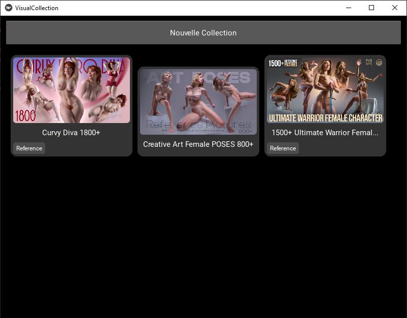

# Visual Collection Manager

Visual Collection Manager is a Python desktop application designed to help users organize and browse their collections of images and visual assets. It provides an intuitive interface for creating collections, assigning tags, and managing visual content stored in local folders.

## Features

*   **Create New Collections:** Easily add new collections with a dedicated name, folder path, and cover image.
*   **Tagging System:** Assign multiple tags to collections for better organization and filtering (tags are displayed as colored boxes on collection cards).
*   **Dynamic Collection Display:** Collections are displayed as cards in a grid layout, showing a preview image (16:9 aspect ratio), name, and tags.
*   **Folder & Image Selection:** Built-in file choosers to select folders and images for collections.
*   **Persistent Storage:** Collection and tag data are stored locally in an SQLite database.
*   **Responsive UI Elements:** Card heights adjust to content, and image previews maintain a consistent aspect ratio.
*   **Open Collection Folders:** Quickly open the folder associated with a collection directly from the application.

## Visual Preview



## Technologies Used

*   **Python 3**
*   **Kivy:** Open source Python library for rapid development of applications with innovative user interfaces.
*   **SQLite:** For local database storage.

## Installation

1.  **Clone the repository:**
    ```bash
    git clone https://github.com/YOUR_USERNAME/VisualCollection.git
    cd VisualCollection
    ```
2.  **Create a virtual environment (recommended):**
    ```bash
    python -m venv venv
    source venv/bin/activate  # On Windows use `venv\Scripts\activate`
    ```
3.  **Install dependencies:**
    ```bash
    pip install -r requirements.txt
    ```

## Usage

1.  Run the application:
    ```bash
    python main.py
    ```
2.  Click on "New Collection" to add your visual assets.
3.  Browse your existing collections from the main screen.

## Future Enhancements

*   Advanced search and filtering by tags or names.
*   Drag and drop support for selecting folders/images.
*    Customizable themes and layouts.
*   Export/import collection data.

## Contributing

Contributions are welcome! If you'd like to contribute, please follow these steps:

1.  Fork the Project.
2.  Create your Feature Branch (`git checkout -b feature/AmazingFeature`).
3.  Commit your Changes (`git commit -m 'Add some AmazingFeature'`).
4.  Push to the Branch (`git push origin feature/AmazingFeature`).
5.  Open a PullRequest.

## License

Distributed under the MIT License. See `LICENSE.txt` for more information. (You will need to create a LICENSE.txt file if you choose this license).

---

*Inspired by interfaces like Hitomi Downloader for a clean and aesthetic user experience.*

1. J'aimerais crée cet app en python, mais j'aimerais quand même un rendu esthétique de l'app
Mon inspiration serais visuelle serais : https://github.com/KurtBestor/Hitomi-Downloader
2. Fonctionnalité :
- J'aimerais un Button "Nouvelle Collection" -> Qui ouvre un menu avec des champ a completer :
    
    "nom" -> un champ de texte
    
    "chemain du dossier" -> Sélection depuis l'ordinateur et/ou glisser-déposer
    
    "image de couverture" -> Sélection depuis l'ordinateur et/ou glisser-déposer
    
    "tags" -> sélecteur de un ou plusieurs de tags
    
- Un section qui affiche des cardes de tout les Collections

1. J'aimerais que mon application garde dans ses dossier plusieurs Base de donnée :

Base de données des collections

| id | nom                | chemin du dossier     | image de couverture | Date de création | tags     |
| -- | ------------------ | --------------------- | ------------------- | ---------------- | -------- |
| 1  | Ma Collection A    | /chemin/vers/dossierA | /images/coverA.jpg  | 2025-05-07       | 1, 2     |
| 2  | Anciennes Affiches | /chemin/vers/dossierB | /images/coverB.png  | 2024-12-15       | 3        |
| 3  | Objets Rares       | /chemin/vers/dossierC | /images/coverC.webp | 2023-10-21       | 2, 4     |

Base de données des tags

| tags\_id | name           |
| -------- | -------------- |
| 1        | illustration   |
| 2        | années 80      |
| 3        | affiche cinéma |
| 4        | objet ancien   |